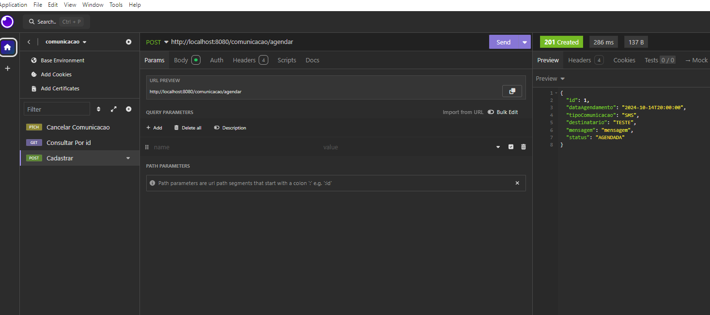
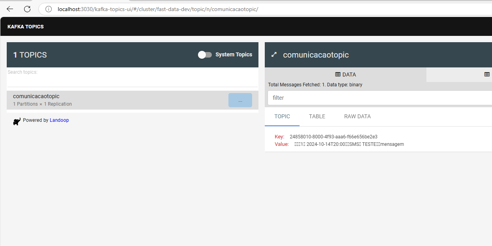

Tecnologias: 
Java 17
maven
spring
kafka
postgresql

Funcionamento geral do programa.
Temos 3 endpoints. No endpoint de cadastro de comunicação é salvo a comunicação na base de dados postgresql com status de agendada.
No endpoint de comunicacao/cancelar/{id} é alterado o status da comunicação para cancelado na base de dados caso o status seja igual a agendado. (nao é permitido cancelar comunicacoes ja enviadas ou ja canceladas.)
O endpoint de consulta, retorna os dados da comunicação pelo id.

Para as comunicações a serem executadas, tem um processo que roda a cada 1 minuto que busca na base dedados todas as 
comunicações que tem a data e horario igual ou inferior ao tempo atual e tenham o status de agendada. 
Essas comunicações recuperadas na base são enviadas na fila do kafka (comunicando). Por fim, o status é alterado para 
enviado e as comunicações são salvas novamente na base de dados com o status atualizado.

Para subir a aplicação, basta entrar na pasta do projeto.

mvn clean install

docker-compose up --build

Aplicação vai ser executada para porta 8080

Para testar os end-points basta importar a collection [comunicacao-collection](collection%2Fcomunicacao-collection) 

A collection tera a seguinte estrutura:

Para verificar as mensagens enviadas no topico do kafka, basta acessar o endereço http://localhost:3030/kafka-topics-u do kafka ui e acessar
o topico comunicacaotopic. 

